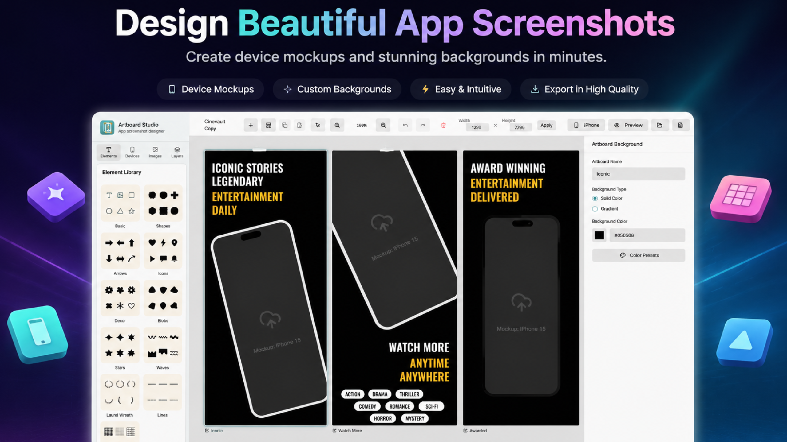
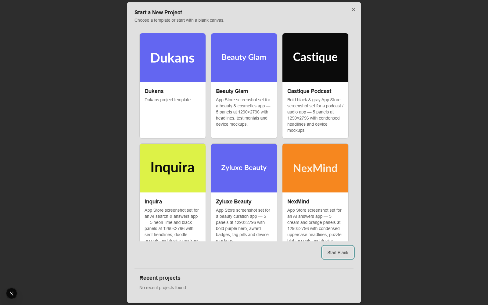

# Open Screenshot Generator

[](LICENSE)
[](https://github.com/dotnetdreamer/open-screenshot-generator/releases/latest)

**Canva for App Store & Play Store graphics.**

A browser-based editor for designing app store screenshots and App Store preview videos. You lay out artboards on a canvas, place device mockups on them, load your app screenshots or screen recordings into the frames, add text and shapes around them, and export PNGs or MP4s at the exact sizes Google Play and the Apple App Store ask for.

Everything runs client-side. Projects are saved to your browser's IndexedDB, so there is no account, no backend, and nothing leaves your machine.

<p align="center">
  
</p>

<p align="center">
  <a href="https://youtu.be/RJmQgoreR2s">
    
  </a>
</p>
<p align="center">
  <em>Watch the walkthrough on YouTube.</em>
</p>

## What it does

- Multiple artboards on one canvas: add, duplicate, rename, and drag them around, with undo/redo across the whole project
- Device frames for iPhone (X through 17 Pro Max), iPad (11-inch and Pro 13-inch), Android (bar, notch, punch-hole), tablet, MacBook, iMac, Apple Watch, and desktop, plus custom frames from your own mockup images
- Screenshots dropped into a frame stay clipped to the device screen; frames can be rotated, scaled, and tilted using perspective presets or a raw CSS `matrix3d` if you need full control
- Text, shapes (rectangles, circles, stars, speech bubbles, custom SVG paths, and more), and plain images as freely placed elements
- A curated set of Google Fonts, including Arabic and Urdu families like Cairo, Amiri, and Noto Nastaliq Urdu, alongside the usual system fonts
- Layers panel for ordering and a properties panel for fine-tuning whatever is selected
- Copy and paste elements within and across artboards
- An export flow that asks which store (Google Play or App Store) and which device classes you're targeting, then renders each artboard to PNG at the store's required dimensions
- App Store preview videos: drop a screen recording into a phone frame, dress it with headlines and tap hints, and export an MP4 (see below)
- Bundled example projects to start from instead of a blank canvas
- An AI agent that builds the project for you from your app screenshots (see below)

## Feature checklist: web vs desktop

The editor itself is identical in the browser and in the desktop app (it is the same build). The desktop shell adds the integrations that need a native process: embedded sign-in windows for the free AI mode, keyless local AI providers, and the MCP server.

| Feature | Web | Desktop |
| --- | :---: | :---: |
| All editor features: artboards, device mockups, 3D poses, templates, store-size PNG export | ✅ | ✅ |
| App preview videos: styled MP4 export, plus store-ready recording conversion (886x1920, 30fps, H.264) | ✅ ¹ | ✅ |
| AI agent with your own API key (Anthropic, OpenAI, Google) | ✅ | ✅ |
| AI agent on the Claude, ChatGPT or Gemini account you already have (beta: Copilot, DeepSeek, Qwen, Perplexity) | ✅ ² | ✅ |
| AI agent with free built-in providers (Pollinations, or local Ollama / LM Studio), no key and no account | ➖ | ✅ |
| MCP server, so Claude Code, Claude Desktop, Cursor or VS Code can drive the editor | ➖ | ✅ |

¹ Needs a browser with the WebCodecs H.264 encoder (Chrome or Edge). PNG export works everywhere.

² In the browser this mode works through a manual relay: copy the prompt into your chat, paste the reply back. The desktop app automates the whole run in an embedded window, nothing extra to install.

## Download the desktop app

Grab the latest installer from the [Releases page](https://github.com/dotnetdreamer/open-screenshot-generator/releases/latest):

| Platform | File |
| --- | --- |
| Windows 10/11 | `Open.Screenshot.Generator_<version>_x64-setup.exe` (or the `.msi`) |
| macOS 10.15+, Intel and Apple silicon | `Open.Screenshot.Generator_<version>_universal.dmg` |
| Linux | `.AppImage` (portable) or `.deb` |

The builds are not code-signed yet, so the first launch takes one extra click: on Windows, SmartScreen shows "Windows protected your PC", so choose More info, then Run anyway. On macOS, right-click the app and choose Open to get past Gatekeeper. On Linux, `chmod +x` the AppImage first.

Prefer the browser? The project now lives at [openscrgen.app](https://openscrgen.app), with the editor at [editor.openscrgen.app](https://editor.openscrgen.app). The same app also runs at [dotnetdreamer.github.io/open-screenshot-generator](https://dotnetdreamer.github.io/open-screenshot-generator/). See [docs/DESKTOP.md](docs/DESKTOP.md) for how the desktop build differs.

## Running it locally

You'll need Node 18.18 or newer (that's Next.js 15's minimum).

```bash
git clone https://github.com/dotnetdreamer/open-screenshot-generator.git
cd open-screenshot-generator
npm install
npm run dev
```

The dev server runs on http://localhost:9002 with Turbopack. When the app opens, pick one of the bundled templates or start blank, and you're in the editor.

<p align="center">
  
</p>
<p align="center">
  <em>The start screen: pick a template or start with a blank canvas.</em>
</p>

Other scripts:

- `npm run build` makes a production build
- `npm run lint` runs ESLint via Next
- `npm run typecheck` runs `tsc --noEmit`

One thing to watch: `npm start` currently re-runs the dev server rather than serving a build. For a production build, run `npm run build` and then `npx next start`.

## How the code is organized

The app is a single Next.js page ([src/app/page.tsx](src/app/page.tsx)) that mounts the editor. The interesting parts live under [src/components/artboard-studio/](src/components/artboard-studio/):

- [ArtboardStudioLayout.tsx](src/components/artboard-studio/ArtboardStudioLayout.tsx) is the top-level component holding most of the state (artboards, selection, undo history, project save/load) and doing the PNG export with `html-to-image`
- [CanvasArea.tsx](src/components/artboard-studio/CanvasArea.tsx) and [Artboard.tsx](src/components/artboard-studio/Artboard.tsx) render the pannable, zoomable canvas and the individual artboards on it
- [elements/](src/components/artboard-studio/elements/) holds the renderers for the element types: text, shape, image, device frame (a screenshot mockup), recording mockup, plain video, and gesture hint. The device frame and the recording mockup share their bezels and notches through [deviceChrome.tsx](src/components/artboard-studio/elements/deviceChrome.tsx) so the two cannot drift apart
- [src/lib/video/](src/lib/video/) is the MP4 exporter: sprite capture, per-frame canvas compositing, and the WebCodecs H.264 encode
- The panels and dialogs around the canvas: [ElementPalette.tsx](src/components/artboard-studio/ElementPalette.tsx), [LayersPanel.tsx](src/components/artboard-studio/LayersPanel.tsx), [PropertiesPanel.tsx](src/components/artboard-studio/PropertiesPanel.tsx), toolbars, and the export/preview dialogs

Around that:

- [src/types/artboard.ts](src/types/artboard.ts) defines the whole data model: artboards, every element type, and projects. If you read one file before touching anything, make it this one; the rest of the codebase is mostly functions that manipulate these types.
- [src/components/ui/](src/components/ui/) has the shadcn/ui-style primitives built on Radix
- [src/services/](src/services/) covers template loading and the Google Fonts helpers
- [src/database.ts](src/database.ts) is the Dexie (IndexedDB) setup: a `projects` table, plus a `media` table holding uploaded recordings as blobs ([mediaStore.ts](src/lib/mediaStore.ts) wraps it)
- [src/lib/elementLibrary.ts](src/lib/elementLibrary.ts) supplies default props for newly added elements

## App Store preview videos

The start dialog has an App Preview Videos tab. Those templates work like the screenshot ones, except
the phone on the artboard is a **recording mockup**: you upload a screen capture of your app and it
plays inside the frame, with your headline, background and tap or swipe hints layered around it. Trim
the clip, animate the text in and out, then export.

The export dialog for these projects offers two things:

- **Styled video.** Your whole artboard rendered to MP4: background, text, the phone frame, and your
  recording playing inside its screen. This is the one for a landing page, a Product Hunt post, or the
  Play Store.
- **Store-ready recording.** No design, just your raw capture conformed to what App Store Connect
  actually accepts (886x1920, 30fps, H.264). A recording straight off an iPhone is 1290x2796 at 60fps
  and gets rejected on upload, so this mode saves a round trip through a video editor.

The encoding happens in your browser with WebCodecs, the same as everything else here: each frame is
composited on a canvas and fed to the hardware H.264 encoder, then muxed to MP4. Nothing is uploaded
anywhere. The recording itself is stored as a blob in IndexedDB rather than inside the project, so an
exported project file stays small and does not carry your footage.

Two things it does not do yet: audio (the MP4 is video only), and 3D or tilted poses for recording
mockups (they render flat).

## The AI agent

The start dialog opens on three choices: start with the AI agent, pick a template, or start blank.
The agent takes your app screenshots plus a sentence about what you want ("put these in a clean dark
template", "use Breathora", "design something new") and produces a finished project: template chosen,
screenshots placed in the device mockups, copy rewritten for your app.

However it runs, it always produces the same thing: an `AgentPlan`, a small
zod-validated JSON document that [buildProjectFromPlan.ts](src/lib/ai/buildProjectFromPlan.ts) turns
into a project deterministically. The model only fills slots (which template, which screenshot goes in
which frame, what the text says, or a constrained new-design spec). It never emits coordinates or
element trees, so a bad plan produces an odd project rather than a broken canvas.

**Use my API key.** Calls go straight from your browser to Anthropic, OpenAI or Google through the
Vercel AI SDK ([providers.ts](src/lib/ai/providers.ts)). The app is a static export with no server, so
there is nowhere else for them to go: your key stays on your machine, and it is only written to
localStorage if you tick "remember on this device".

**Free, use my account.** Uses whatever Claude, ChatGPT, Gemini (and beta: Copilot, DeepSeek, Qwen,
Perplexity) session you are already signed into. In the desktop app this drives the provider in an
embedded window with no extension needed (see [docs/DESKTOP.md](docs/DESKTOP.md)). In the browser it
runs through the small companion extension in [extension/](extension/README.md), and without the
extension the panel falls back to a manual relay (copy the prompt, paste it into the chat, paste the
answer back), so the mode works everywhere.

**Free, built in.** Desktop only: keyless providers (Pollinations, or a local Ollama / LM Studio),
also covered in [docs/DESKTOP.md](docs/DESKTOP.md).

**How the templates reach the model.** The catalog of all templates is too big to paste into a chat
(ChatGPT's free tier rejects the message outright). So "use my account" runs are URL-first: the
message carries only a link to [public/data/ai/catalog.txt](public/data/ai/catalog.txt), the full
catalog hosted by this repo's Pages deployment, and the model must echo the file's verification
token to prove it actually fetched it. If it can't, the app falls back to an inline catalog that is
prefiltered, id-aliased, and shrunk to the provider's message cap. The whole scheme, its fallbacks,
and the tuning knobs are documented in [docs/AI-AGENT.md](docs/AI-AGENT.md).

The prompts, the catalog builders, and the plan schema all live in [src/lib/ai/](src/lib/ai/).

## Storage and templates

Saved projects live in IndexedDB under a database called `ProjectDatabase`. Clearing site data deletes them, so treat exported PNGs and MP4s as your real output and the browser store as a working copy. Uploaded screen recordings sit in the same database in a separate `media` table, and projects only reference them by id, so an exported project file stays small and does not carry your footage with it.

Templates are plain JSON files in [public/data/projects/](public/data/projects/), fetched at runtime. The file list is hardcoded in [projectService.ts](src/services/projectService.ts), so adding your own template means dropping a JSON file in that folder and adding its filename to the array. A template is essentially a saved array of artboard states. The practical way to make one is to design it in the app and copy the shape of an existing template file.

After adding or editing templates, regenerate the AI agent's hosted catalog with `npm run gen:ai-catalog` (a normal `npm run build` also does it) so [public/data/ai/catalog.txt](public/data/ai/catalog.txt) stays in sync; see [docs/AI-AGENT.md](docs/AI-AGENT.md).

## Loose ends worth knowing about

- `next build` is configured to ignore TypeScript and ESLint errors ([next.config.ts](next.config.ts)), so a passing build doesn't mean the types are clean. Run `npm run typecheck` yourself before opening a PR.
- [src/ai/](src/ai/) contains Genkit scaffolding (Google AI plugin, plus the `genkit:dev` and `genkit:watch` scripts), but no flows are wired up yet. The app runs fine without it. The AI agent does not use it; that lives in [src/lib/ai/](src/lib/ai/) and runs entirely client side.
- The companion extension's site adapters are CSS selectors ([extension/src/adapters/](extension/src/adapters/)). When Claude, ChatGPT or Gemini redesign, a selector list needs updating; the manual relay keeps working in the meantime.
- MP4 export needs the WebCodecs `VideoEncoder`, which Chrome, Edge and the desktop app have. On a browser without it the export stops with a message rather than falling back to something slower; PNG export is unaffected.
- There's no test suite at the moment; `typecheck` and `lint` are the safety net.

## Contributing

Issues and pull requests are welcome. If you're planning something bigger than a bug fix, open an issue first so we can talk it through before you spend time on it. [CONTRIBUTING.md](CONTRIBUTING.md) has the dev setup and the checks to run before a PR.

## License

Open Screenshot Generator is released under the [MIT License](LICENSE).
