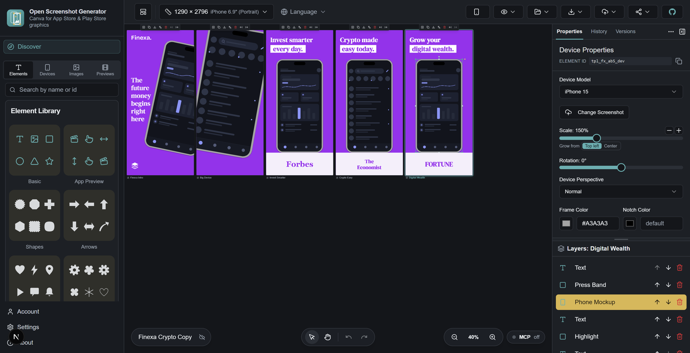
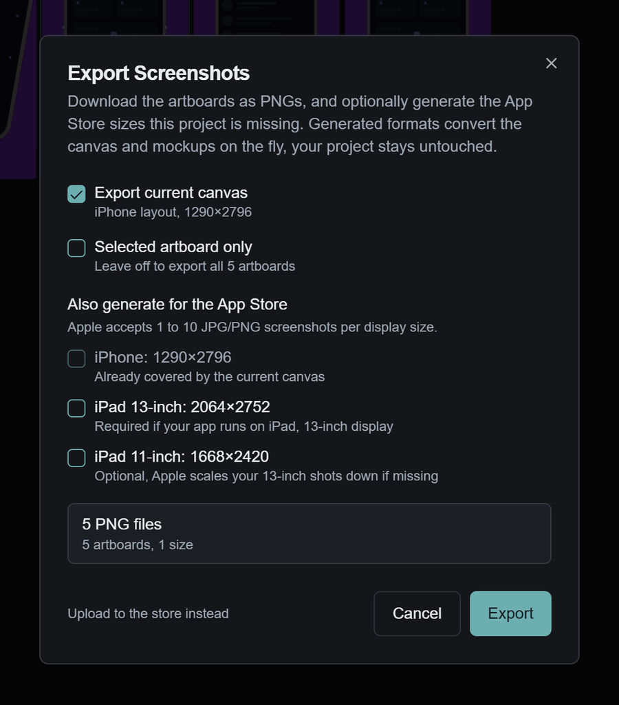
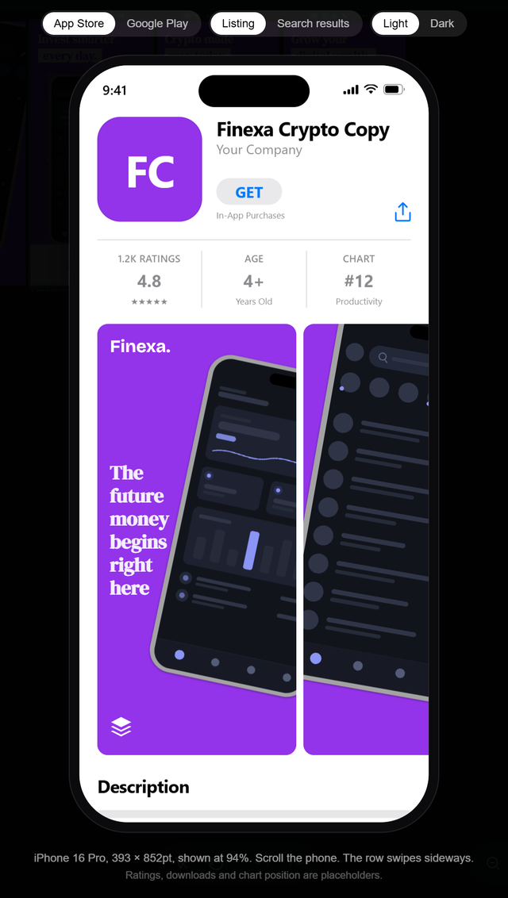
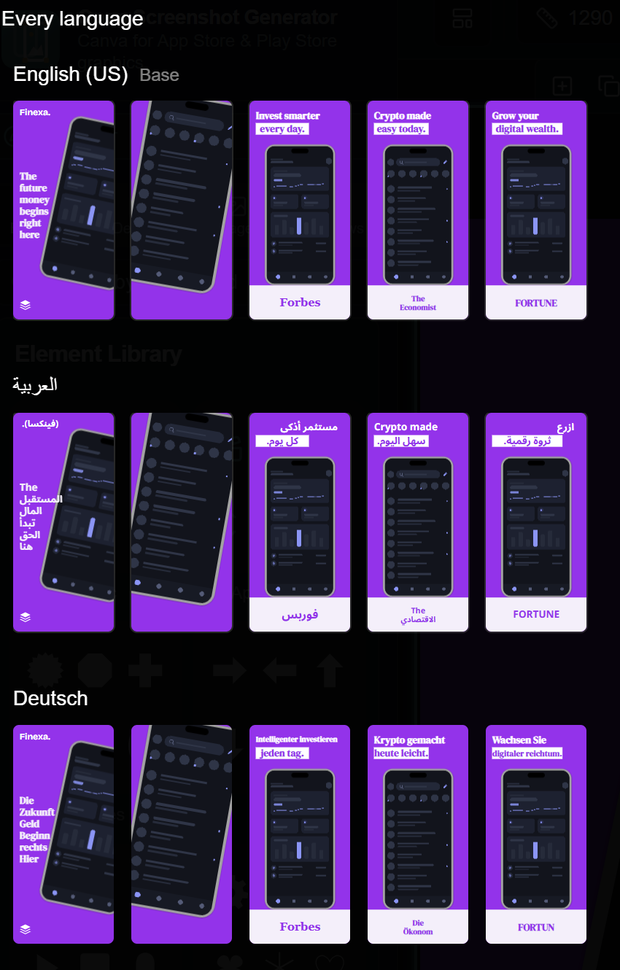
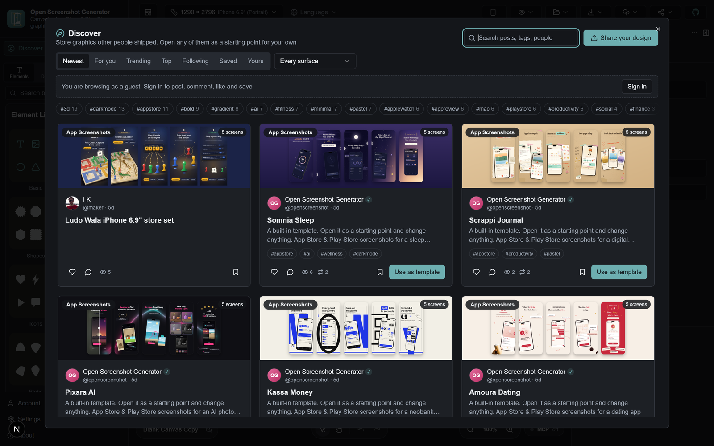
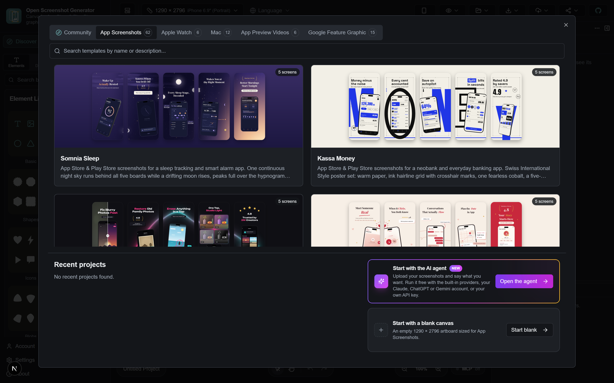
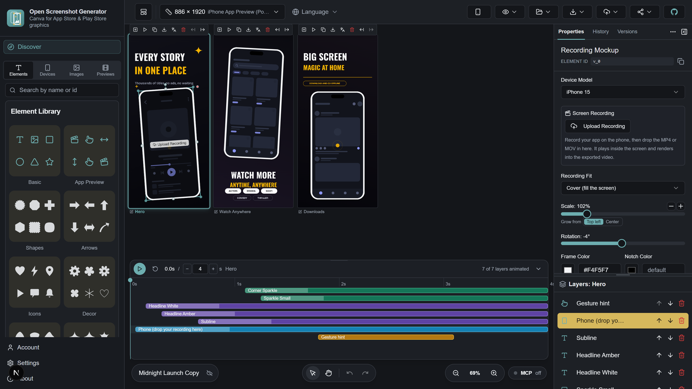
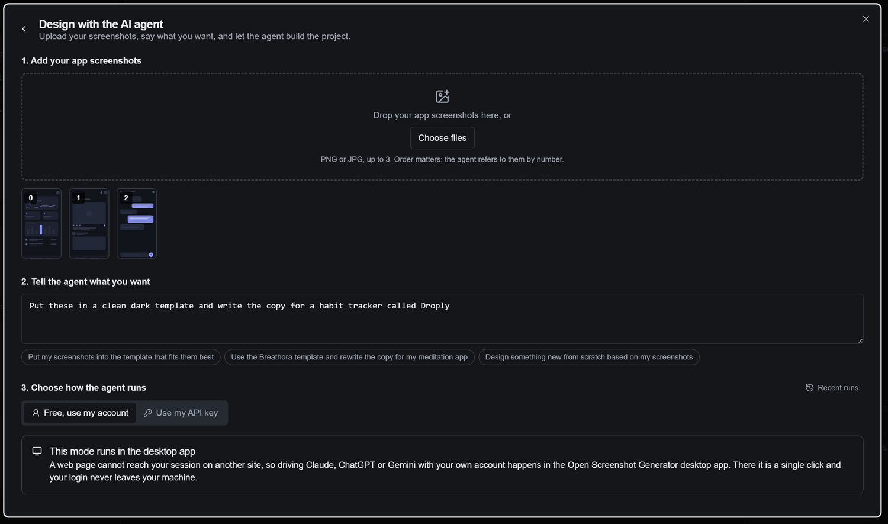

# Open Screenshot Generator

[](LICENSE)
[](https://github.com/dotnetdreamer/open-screenshot-generator/releases/latest)

**Canva for App Store & Play Store graphics**

<p align="center">
  
</p>

<p align="center">
  <em><a href="https://youtu.be/gfABjk1Q_Z0?si=uWIIoq1cgQIQSgud">Watch the walkthrough on YouTube.</a></em>
</p>

A browser-based editor for designing app store screenshots and App Store preview videos. You lay out artboards on a canvas, place device mockups on them, load your app screenshots or screen recordings into the frames, add text and shapes around them, and export PNGs or MP4s at the exact sizes Google Play and the Apple App Store ask for.

Everything runs client-side. Projects are saved to your browser's IndexedDB, so by default there is no account, no backend, and nothing leaves your machine. If you want your work on more than one device, sign in and the open project is kept in your cloud on its own, or connect your own Google Drive or GitHub account and keep it in storage you own.

<p align="center">
  
</p>
<p align="center">
  <em>The whole set on one canvas. Pick any mockup and its model, pose, frame and screenshot placement are one panel away.</em>
</p>

## What's new

### 21 August 2026: panels on another screen, smaller exports

The right dock (Properties, History, Versions, Layers) can now be opened in its own window and left on a second display, and the editor can move to whichever display you pick. Exports came out better too: text renders in exactly the fonts you chose, and PNGs are written the way App Store Connect wants them, at roughly a third of the file size.

Before that:

- **20 August.** A dashboard for anyone running their own Discover feed: moderation, accounts, posts, storage and growth in one place. [Setup](infra/vps/README.md)
- **19 August.** **Versions** in the History tab keeps checkpoints as you work, when you open a project, every ten minutes, before a device conversion, on every export, and whenever you name one; put any of them back in a click, or **Open as a copy** to fork it. **Share > Edit together** hands out one link and everybody works on the same project at once, each with their own cursor, and the design travels straight between the browsers in the session rather than through us. Signed in, the open project also saves itself without anybody clicking Save, and a mouse wheel over the canvas zooms around the pointer.
- **17 August.** **Save > To the cloud** keeps the editable project behind your sign-in. **Share > Get a link to share** turns it into a link that hands anyone their own copy.
- **14 August.** **Discover**, a community feed of store graphics, any of them openable as a starting point. Optional, and it runs on a server you own. [Setup](infra/vps/README.md)
- **12 August.** One project, every language: one layout, with text, fonts and screenshots per language, and machine translations to start from. [60 second walkthrough](https://youtu.be/mO17AX-PXgc)
- **11 August.** Import your own font files and use them like the built in ones, and put manual line breaks in text.
- **7 August.** Export a single artboard with a progress dialog you can cancel, save to your account without silently overwriting, translate one element or artboard.
- **6 August.** The desktop app uploads finished artboards straight to App Store Connect or Google Play with your own developer credentials. [Setup guide](docs/STORE-UPLOAD.md)
- **30 July.** One click translates artboard text into 50+ languages.
- **25 July.** Save projects into storage you own: whole projects to Google Drive, the design to GitHub, browsable from the **Account** button. [Setup](docs/ACCOUNT-SYNC.md)

## What it does

- **Discover**: a community feed of store graphics people shared, searchable by tag, surface and text, with every post openable as a new project. Read-only for visitors, open to anyone signed in. See [infra/vps/README.md](infra/vps/README.md) for the backend, which is optional and self-hosted
- **Cloud projects**: save the working file to that same backend and reopen it on another device, or turn on a link and hand somebody an editable copy of the design. Private by default, revocable, and gated behind the same sign-in. Your browser's copy stays the one you are editing
- **Edit together**: one link puts everybody on the same project at once, each with their own cursor, and the design travels straight between the browsers in the session rather than through a server of ours
- **Versions**: checkpoints are kept as you work, when you open a project, every ten minutes, before a device conversion, on every export, and whenever you name one. Put any of them back in a click, or open one as a copy to fork it. The History tab still holds the full undo trail for the session
- **One project, every language**: one layout, with text, fonts and screenshots per language, across 57 languages. Machine translations give you something to edit, a translation table shows every string side by side, and a CSV round trip hands the whole thing to a translator and takes it back
- Multiple artboards on one canvas: add, duplicate, rename, and drag them around, with undo/redo across the whole project
- Device frames for iPhone (X through 17 Pro Max), iPad (11-inch and Pro 13-inch), Android (bar, notch, punch-hole), tablet, MacBook, iMac, Apple Watch, and desktop, plus custom frames from your own mockup images
- Screenshots dropped into a frame stay clipped to the device screen; frames can be rotated, scaled, and tilted using perspective presets or a raw CSS `matrix3d` if you need full control
- Text, shapes (rectangles, circles, stars, speech bubbles, custom SVG paths, and more), and plain images as freely placed elements
- An image library to place around the mockups: licensed photographs of hands holding and pointing at phones, of people, food and study scenes, all cut out on transparency, plus store badges for the App Store, Google Play, Microsoft Store, Amazon Appstore and F-Droid. [Where every photo came from](docs/image-asset-licenses.md)
- 61 Google Fonts, including Arabic and Urdu families like Cairo, Amiri, and Noto Nastaliq Urdu, alongside the usual system fonts, plus your own font files imported from disk
- Layers panel for ordering and a properties panel for fine-tuning whatever is selected, in one right dock that can be torn off into its own window and left on a second display
- A dark theme for the editor (Settings > Appearance: follow your system, or force light or dark) that deliberately stops at the artboard edge, so your designs look on screen exactly as they export
- Copy and paste elements within and across artboards
- An export flow that asks which store (Google Play or App Store) and which device classes you're targeting, then renders each artboard to PNG at the store's required dimensions
- **Store listing preview**: the finished set shown the way the store shows it, App Store or Google Play, product page or search results, light or dark, at real size on a phone, before anything is uploaded
- App Store preview videos: drop a screen recording into a phone frame, dress it with headlines and tap hints, and export an MP4 (see below)
- 20 ready made preview boards in the **Previews** tab: a whole animated board, timings included, that only wants your recording dropped into the phone
- 101 bundled templates across App Screenshots, Apple Watch, Mac, App Preview Videos and Google Feature Graphic, to start from instead of a blank canvas
- An AI agent that builds the project for you from your app screenshots (see below)
- An MCP server, so Claude Code, Claude Desktop, Cursor or VS Code can drive the editor with 49 tools while you watch it happen on the canvas
- Optional account saving to your own Google Drive or GitHub, so projects follow you between machines without us storing anything (see below)
- Direct upload to App Store Connect and Google Play from the desktop app, using your own developer credentials (see below)

## A closer look

<table>
<tr>
<td width="50%" valign="top">

<p><em>One canvas covers every size. The export dialog converts the boards and the mockups on the fly, and your project stays as you left it.</em></p>
</td>
<td width="50%" valign="top">

<p><em>The store listing preview, at the size a shopper actually sees. Switch between App Store and Google Play, product page and search results, light and dark.</em></p>
</td>
</tr>
<tr>
<td width="50%" valign="top">

<p><em>Every language off one layout. Arabic comes back right to left in a face that carries the glyphs, and a design change reaches all of them at once.</em></p>
</td>
<td width="50%" valign="top">

<p><em>Discover, the community feed. Every post opens as a new project. It is optional, and the backend is one you run.</em></p>
</td>
</tr>
</table>

## How it compares

Most tools in this space are a subscription with a free tier that stops just short of the thing you needed. Here there is no paid tier, no account, no watermark, no export cap, and no gated device size, and the source is in this repository. Checked against public pricing and documentation in August 2026:

| | Open Screenshot Generator | AppScreens | Previewed | AppMockUp Studio | Smartmockups |
| --- | --- | --- | --- | --- | --- |
| Price | Free, no paid tier exists | Free plan, then $25 a month or $99 a year, Scale at $180 a year | Free tier, Plus at $9.99 once for 10 exports, Pro at $228 a year | Free | Folded into Canva, which has free and paid plans |
| Account | None | Required, projects live in their cloud | Needed before the template pages show anything | None | Canva account required |
| Free exports at store sizes | Every size both stores require, full resolution | Core sizes free, Apple Watch, Vision Pro, Wear OS and custom sizes need a plan, and Pro features stamp a watermark | 2D exports capped at 720p, under a Creative Commons attribution licence | Yes, on iPhone and Android frames | No store size workflow, you set the dimensions up yourself |
| App preview videos | Yes, MP4 rendered in your browser, plus a store ready conversion | Not offered | Animated promo videos, on 2022 era devices | Not offered | Canva edits video, but there is no app preview workflow |
| Open source | Yes, MIT | No | No | No | No |

Credit where it is due: AppMockUp is free with no account and has lovely background generators, and Previewed's 3D renders still look better than most. The longer comparisons, one tool at a time, are on the site: [AppScreens](https://openscrgen.app/appscreens-alternative), [Previewed](https://openscrgen.app/previewed-alternative), [AppMockUp](https://openscrgen.app/appmockup-alternative), [Smartmockups](https://openscrgen.app/smartmockups-alternative).

Past price, these are the parts that tend not to exist in the paid tools at all:

- **An AI agent on the subscription you already pay for.** Point it at the Claude, ChatGPT or Gemini account you are already signed into and it picks a template, places your screenshots and writes the copy. No API key, no per export credits, and the desktop app drives it in an embedded window so the login never leaves your machine
- **Your AI client can drive the editor.** The MCP server exposes 49 tools, so Claude Code, Claude Desktop, Cursor or VS Code can build and edit boards, add languages and export PNGs while you watch it happen on the canvas
- **Real localization, not a text field.** One layout, 57 languages, per language text, fonts and screenshots, machine translations to edit, and a CSV a translator can fill in and hand back
- **App preview videos that survive review.** Beyond the styled MP4, there is a mode that keeps your text and gesture hints over a full screen capture, which is what App Review guideline 2.3.4 actually allows, and a store ready conversion to 886x1920 at 30fps H.264
- **See the store before the store sees it.** The listing preview puts the finished set inside an App Store or Play product page and a search result, light and dark, at real size
- **Everybody on one link.** Live collaboration runs peer to peer between the browsers in the session, with a cursor each
- **The store upload is free.** The desktop app pushes finished artboards to App Store Connect or Google Play with your own developer credentials, no plan involved
- **Panels on your second monitor.** Properties, History, Versions and Layers can be torn out of the window and left on another display
- **The work stays yours.** Browser storage by default, or your own Google Drive or GitHub, or a Discover feed running on a server you control. Nothing is required to leave your machine

## Feature checklist: web vs desktop

The editor itself is identical in the browser and in the desktop app (it is the same build). The desktop shell adds the integrations that need a native process: embedded sign-in windows for the free AI mode, keyless local AI providers, and an MCP server it can host on its own.

| Feature | Web | Desktop |
| --- | :---: | :---: |
| All editor features: artboards, device mockups, 3D poses, templates, store-size PNG export, store listing preview, versions, per language boards, live collaboration | ✅ | ✅ |
| App preview videos: styled MP4 export, plus store-ready recording conversion (886x1920, 30fps, H.264) | ✅ ¹ | ✅ |
| AI agent with your own API key (Anthropic, OpenAI, Google) | ✅ | ✅ |
| AI agent on the Claude, ChatGPT or Gemini account you already have (beta: Copilot, DeepSeek, Qwen, Perplexity) | ✅ ² | ✅ |
| AI agent with free built-in providers (Pollinations, or local Ollama / LM Studio), no key and no account | ➖ | ✅ |
| MCP server, so Claude Code, Claude Desktop, Cursor or VS Code can drive the editor | ✅ ⁵ | ✅ |
| Save projects to your own Google Drive or GitHub account | ✅ ³ | ✅ |
| Upload screenshots straight to App Store Connect or Google Play | ➖ ⁴ | ✅ |

¹ Needs a browser with the WebCodecs H.264 encoder (Chrome or Edge). PNG export works everywhere.

² In the browser this mode works through a manual relay: copy the prompt into your chat, paste the reply back. The desktop app automates the whole run in an embedded window, nothing extra to install.

³ Google sign-in is identical on both. GitHub sign-in on the web needs a tiny token-exchange Worker (included, free to run) because GitHub's OAuth requires a client secret that a static site cannot hold; without it the web build asks for a personal access token instead. The desktop app uses GitHub's device flow and needs neither.

⁴ Not a product decision: App Store Connect serves no CORS headers, so no browser tab can call it. The desktop app makes these requests outside the webview. See [docs/STORE-UPLOAD.md](docs/STORE-UPLOAD.md).

⁵ Same 49 tools either way, and they run in the app either way. The desktop app hosts the server itself on `127.0.0.1`, because a native process can open a socket; a browser tab cannot, so the web build connects out to a small relay that passes messages between your AI client and your tab ([infra/vps/mcp-relay](infra/vps/mcp-relay/README.md), free to run, no database and no account). Set `NEXT_PUBLIC_MCP_RELAY_URL` to switch it on. The one thing only the desktop app can do is write exported PNGs straight into a folder you name.

## Running it locally

You'll need Node 18.18 or newer (that's Next.js 15's minimum).

```bash
git clone https://github.com/dotnetdreamer/open-screenshot-generator.git
cd open-screenshot-generator
npm install
npm run dev
```

The dev server runs on http://localhost:9002 with Turbopack. When the app opens, pick one of the bundled templates or start blank, and you're in the editor.

Everything works without any further setup. The Discover feed and cloud projects are the parts that need a backend, and both are off unless you point at one — with `NEXT_PUBLIC_DISCOVER_URL` unset there is no rail button, no Community tab and no Save to cloud, and nothing else changes. To run it too, `infra/vps` brings the whole thing up in Docker in one command:

```bash
cd infra/vps
docker compose -f docker-compose.yml -f docker-compose.local.yml up -d --build
```

then set `NEXT_PUBLIC_DISCOVER_URL=http://127.0.0.1:8090` in `.env.local`. [Full instructions, including seeding it with the bundled templates](infra/vps/README.md#running-it-locally).

<p align="center">
  
</p>
<p align="center">
  <em>The start screen: 101 templates across five categories, whatever the community shared today, the AI agent, or a blank canvas.</em>
</p>

Other scripts:

- `npm run build` makes a production build
- `npm run lint` runs ESLint via Next
- `npm run typecheck` runs `tsc --noEmit`

One thing to watch: `npm start` currently re-runs the dev server rather than serving a build. For a production build, run `npm run build` and then `npx next start`.

## App Store preview videos

The start dialog has an App Preview Videos tab. Those templates work like the screenshot ones, except
the phone on the artboard is a **recording mockup**: you upload a screen capture of your app and it
plays inside the frame, with your headline, background and tap or swipe hints layered around it. Trim
the clip, animate the text in and out, then export.

Select a board with motion and a timeline appears across the bottom of the canvas, with a row for every
layer on it. Layers you have not animated sit there as dashed placeholders: drag one along the timeline
(or drop a layer onto it from the Layers panel) and it fades in at that second, which is all it takes to
start animating. Press play and the whole thing runs in place: text animates in and out on its timings,
gesture hints fire when they are set to, and your recording plays inside the phone. Drag the playhead
to scrub, drag a clip sideways to retime it, drag its edges to trim, drag it up or down to restack the
layer, and set the preview's length in the field next to the clock. It runs the same timing code the
encoder does, so nothing has to be exported to see what you are getting.

<p align="center">
  
</p>
<p align="center">
  <em>A preview board and its timeline. Every layer has a clip you can retime, trim or restack, and the phone is waiting for your recording.</em>
</p>

The export dialog for these projects offers three renders:

- **Styled video.** Your whole artboard rendered to MP4: background, text, the phone frame, and your
  recording playing inside its screen. This is the one for a landing page, a Product Hunt post, or the
  Play Store. App Store Connect rejects it, see below.
- **Store-ready with your text.** Your recording full screen at Apple's size, with the artboard's text
  and gesture hints animating over it. App Review guideline 2.3.4 says a preview "may only use video
  screen captures of the app itself", which rules out the phone frame and the designed background, but
  it also says "you can add narration and video or textual overlays to help explain anything that isn't
  clear from the video alone". So this one keeps your words and still uploads.
- **Store-ready recording.** No design at all, just your capture conformed to what App Store Connect
  accepts (886x1920, 30fps, H.264). A recording straight off an iPhone is 1290x2796 at 60fps and gets
  rejected on upload, so this mode saves a round trip through a video editor.

The encoding happens in your browser with WebCodecs, the same as everything else here: each frame is
composited on a canvas and fed to the hardware H.264 encoder, then muxed to MP4. Nothing is uploaded
anywhere. The recording itself is stored as a blob in IndexedDB rather than inside the project, so an
exported project file stays small and does not carry your footage.

Two things it does not do yet: audio (the MP4 is video only, and the canvas player is silent too), and
3D or tilted poses for recording mockups (they render flat).

## The AI agent

The start dialog opens on three choices: start with the AI agent, pick a template, or start blank.
The agent takes your app screenshots plus a sentence about what you want ("put these in a clean dark
template", "use Breathora", "design something new") and produces a finished project: template chosen,
screenshots placed in the device mockups, copy rewritten for your app. Every run keeps a timeline of what
it did, reachable from **Recent runs**, so a project you did not expect can be read back step by step.

<p align="center">
  
</p>
<p align="center">
  <em>Three screenshots, one sentence, and a choice of who runs the model. The account mode uses the Claude, ChatGPT or Gemini subscription you already have.</em>
</p>

However it runs, it always produces the same thing: an `AgentPlan`, a small
zod-validated JSON document that [buildProjectFromPlan.ts](src/lib/ai/buildProjectFromPlan.ts) turns
into a project deterministically. The model only fills slots (which template, which screenshot goes in
which frame, what the text says, or a constrained new-design spec). It never emits coordinates or
element trees, so a bad plan produces an odd project rather than a broken canvas.

**Use my API key.** Calls go straight from your browser to Anthropic, OpenAI or Google through the
Vercel AI SDK ([providers.ts](src/lib/ai/providers.ts)). The app is a static export with no server, so
there is nowhere else for them to go: your key stays on your machine, and it is only written to
localStorage if you tick "remember on this device".

**Free, use my account.** Uses whatever Claude, ChatGPT, Gemini (and beta: Copilot, DeepSeek, Qwen,
Perplexity) session you are already signed into. In the desktop app this drives the provider in an
embedded window with no extension needed (see [docs/DESKTOP.md](docs/DESKTOP.md)). In the browser it
runs through the small companion extension in [extension/](extension/README.md), and without the
extension the panel falls back to a manual relay (copy the prompt, paste it into the chat, paste the
answer back), so the mode works everywhere.

**Free, built in.** Desktop only: keyless providers (Pollinations, or a local Ollama / LM Studio),
also covered in [docs/DESKTOP.md](docs/DESKTOP.md).

**How the templates reach the model.** The catalog of all templates is too big to paste into a chat
(ChatGPT's free tier rejects the message outright). So "use my account" runs are URL-first: the
message carries only a link to [public/data/ai/catalog.txt](public/data/ai/catalog.txt), the full
catalog hosted by this repo's Pages deployment, and the model must echo the file's verification
token to prove it actually fetched it. If it can't, the app falls back to an inline catalog that is
prefiltered, id-aliased, and shrunk to the provider's message cap. The whole scheme, its fallbacks,
and the tuning knobs are documented in [docs/AI-AGENT.md](docs/AI-AGENT.md).

The prompts, the catalog builders, and the plan schema all live in [src/lib/ai/](src/lib/ai/).

## Storage and templates

Saved projects live in IndexedDB under a database called `ProjectDatabase`. Clearing site data deletes them, so treat exported PNGs and MP4s as your real output and the browser store as a working copy. Uploaded screen recordings sit in the same database in a separate `media` table, and projects only reference them by id, so an exported project file stays small and does not carry your footage with it.

Templates are plain JSON files in [public/data/projects/](public/data/projects/), fetched at runtime. The catalog that lists them, and the tab each one belongs in, is [templateCategories.ts](src/lib/templateCategories.ts), so adding your own template means dropping a JSON file in that folder and adding its filename to the right category. A template is essentially a saved array of artboard states. The practical way to make one is to design it in the app and copy the shape of an existing template file.

After adding or editing templates, regenerate the AI agent's hosted catalog with `npm run gen:ai-catalog` (a normal `npm run build` also does it) so [public/data/ai/catalog.txt](public/data/ai/catalog.txt) stays in sync; see [docs/AI-AGENT.md](docs/AI-AGENT.md).

## Loose ends worth knowing about

- `next build` is configured to ignore TypeScript and ESLint errors ([next.config.ts](next.config.ts)), so a passing build doesn't mean the types are clean. Run `npm run typecheck` yourself before opening a PR.
- [src/ai/](src/ai/) contains Genkit scaffolding (Google AI plugin, plus the `genkit:dev` and `genkit:watch` scripts), but no flows are wired up yet. The app runs fine without it. The AI agent does not use it; that lives in [src/lib/ai/](src/lib/ai/) and runs entirely client side.
- The companion extension's site adapters are CSS selectors ([extension/src/adapters/](extension/src/adapters/)). When Claude, ChatGPT or Gemini redesign, a selector list needs updating; the manual relay keeps working in the meantime.
- MP4 export needs the WebCodecs `VideoEncoder`, which Chrome, Edge and the desktop app have. On a browser without it the export stops with a message rather than falling back to something slower; PNG export is unaffected.
- There's no test suite at the moment; `typecheck` and `lint` are the safety net.

## Contributing

Issues and pull requests are welcome. If you're planning something bigger than a bug fix, open an issue first so we can talk it through before you spend time on it. [CONTRIBUTING.md](CONTRIBUTING.md) has the dev setup and the checks to run before a PR.

## License

Open Screenshot Generator is released under the [MIT License](LICENSE).
