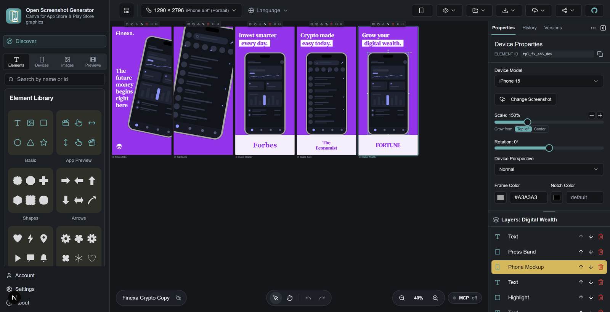
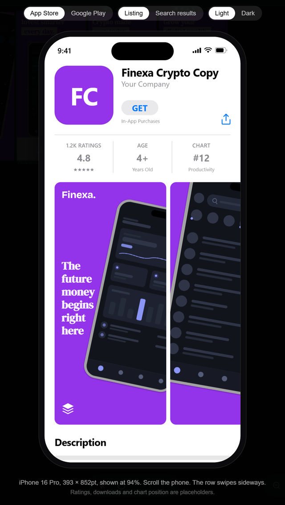

# Open Screenshot Generator

[](LICENSE)
[](https://github.com/dotnetdreamer/open-screenshot-generator/releases/latest)

Make screenshots and preview videos for the App Store and Google Play. Start with a template, add screenshots of your app, change the text and colors, then export the finished files at store sizes.

Open the [web editor](https://editor.openscrgen.app), download the [desktop app](https://github.com/dotnetdreamer/open-screenshot-generator/releases/latest), or [watch the walkthrough](https://youtu.be/gfABjk1Q_Z0?si=uWIIoq1cgQIQSgud).

<p align="center">
  
</p>

## What's new

### 29 September 2026: Claude Code in the desktop app

The desktop app's AI agent can now run in Claude Code on your computer, on the Claude plan you already use, with nothing to sign in to in the app. Choose **Claude Code** on the agent screen and it builds the design in a new project while you watch. Keep asking for changes in the new **Agent** tab of the right panel. [How it works](docs/AI-AGENT.md#4-claude-code-mode-the-agent-edits-the-live-project).

### 29 September 2026: New CLI

You can now make store images from a terminal or a script with `npx open-screenshot-generator`. It can also connect its design tools to a coding agent. [Start with the CLI](#command-line-and-coding-agents).

Recent additions also include a second window for the right panel, project versions, live editing with others, cloud saving, translations, imported fonts, and direct store uploads from the desktop app.

## What it does

1. Open a template or a blank canvas.
2. Add your app screenshots to the device frames.
3. Edit the text, images, colors, and layout. You can make several designs in one project.
4. Preview how the set looks in a store listing, then export the sizes you need.

You can also:

- Choose from 101 templates for app screenshots, Apple Watch, Mac, preview videos, and Google Play feature graphics.
- Make one layout for several languages and edit each language's text and screenshots.
- Make preview videos from a screen recording.
- Ask the AI agent to pick a template, place screenshots, and draft text.
- Save versions of your project, share a copy, or invite others to edit with you.
- Upload finished screenshots to App Store Connect or Google Play from the desktop app.

## A closer look

<p align="center">
  
</p>

The canvas holds all your designs together. Choose an item to change it in the right panel. The export dialog checks store sizes, and the listing preview shows your images as shoppers will see them.

<p align="center">
  
</p>

## How it compares

Open Screenshot Generator is free and open source, with no watermark or export cap. You can use it without an account and save projects locally. The site has longer comparisons with [AppScreens](https://openscrgen.app/appscreens-alternative), [Previewed](https://openscrgen.app/previewed-alternative), [AppMockUp](https://openscrgen.app/appmockup-alternative), and [Smartmockups](https://openscrgen.app/smartmockups-alternative).

## Feature checklist: web vs desktop

Both versions use the same editor. The desktop app adds features that need access to your computer or developer accounts.

| Feature | Web editor | Desktop app |
| --- | --- | --- |
| Templates, design tools, languages, store size PNG export | Yes | Yes |
| Preview video export | In Chrome or Edge | Yes |
| AI agent with your own API key | Yes | Yes |
| AI agent with an existing assistant account | Copy and paste, or use the [companion extension](extension/README.md) | Built in assistant window |
| Built in or local AI providers | No | Yes |
| AI agent in Claude Code, on your Claude plan | No | Yes |
| Coding agent design tools | With the [web relay](infra/vps/mcp-relay/README.md) or CLI | Built in MCP server |
| Save to your own Google Drive or GitHub account | Yes | Yes |
| Upload screenshots directly to App Store Connect or Google Play | No | Yes |

## Command line and coding agents

The CLI needs Node 20.12 or newer and Chrome, Edge, or Chromium. Put screenshots of your app in a folder called `shots`, then run:

```bash
npx open-screenshot-generator doctor
npx open-screenshot-generator init
npx open-screenshot-generator fill --screenshots ./shots
npx open-screenshot-generator render
npx open-screenshot-generator verify
```

`fill` chooses a template and places your screenshots. `render` makes the image files, and `verify` checks them against store rules. [More CLI commands](cli/README.md)

To connect the design tools to a coding agent, run:

```bash
npx open-screenshot-generator install
```

The package includes [skills for common store asset tasks](skills/README.md). In Claude Code, you can install the plugin with:

```text
/plugin marketplace add dotnetdreamer/open-screenshot-generator
/plugin install open-screenshot-generator@open-screenshot-generator
```

## Running it locally

You need Node 18.18 or newer to run the web editor from this repository.

```bash
git clone https://github.com/dotnetdreamer/open-screenshot-generator.git
cd open-screenshot-generator
npm install
npm run dev
```

Open <http://localhost:9002>. Choose a template or start blank. Local design and export work without a backend. The community feed and cloud saving need the [optional backend](infra/vps/README.md).

## App Store preview videos

Choose **App Preview Videos** on the start screen, pick a template, and add a screen recording to its phone frame. Change the text and timing on the timeline, then export an MP4.

For App Store Connect, choose an export based on your screen recording. The styled video option includes the background and phone frame and is intended for other uses, such as a website or social post. MP4 export needs Chrome, Edge, or the desktop app.

## The AI agent

On the start screen, choose the AI agent, add screenshots, and describe the design you want. You can review and edit the project it makes. Choose your own API key, an assistant account you already use, or one of the desktop app's built in providers. The desktop app also offers Claude Code, the first choice on that screen: if it is installed and signed in on your computer, the agent uses your Claude plan, builds the design in a new project while you watch, and stays in the **Agent** tab of the right panel for more changes. The [AI agent guide](docs/AI-AGENT.md) explains these choices.

## Storage and templates

Projects are saved on your device by default. Clearing the browser's site data removes its local projects, so keep a copy of work you want to preserve. If you sign in, you can save projects to the app's cloud service. You can also connect [your own Google Drive or GitHub account](docs/ACCOUNT-SYNC.md).

Templates are JSON files in [public/data/projects/](public/data/projects/). To add one, follow the steps in [CONTRIBUTING.md](CONTRIBUTING.md).

## Loose ends worth knowing about

- The web editor needs Chrome or Edge for MP4 export. PNG export works in other browsers.
- `npm start` starts the development server. Use `npm run build` to make a production build.
- Contributors should run `npm run typecheck` and the [end to end tests](tests/e2e/README.md). The build does not check types, and the lint script currently opens a setup prompt.

## Contributing

Issues and pull requests are welcome. See [CONTRIBUTING.md](CONTRIBUTING.md) for setup and template instructions.

## License

The code is available under the [MIT License](LICENSE). Bundled images and other assets have separate licenses. Read [THIRD-PARTY-ASSETS.md](THIRD-PARTY-ASSETS.md) before copying or redistributing them.
